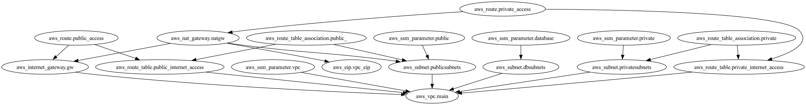

# arquiteturacontainers

## Requirements

Terraform
Inframap
Graphviz

## Comandos

Operacao terraform
terraform fmt --recursive
terraform init -backend-config=environment/dev/backend.tfvars
terraform validate

Criacao de infra
terraform apply -auto-approve -var-file=environment/dev/terraform.tfvars

Destruicao de infra
terraform destroy -auto-approve -var-file=environment/dev/terraform.tfvars

Criacao de diagrama
inframap generate ./ --raw | dot -Tpng > diagrama.png

## Estrutura

<!-- BEGIN_TF_DOCS -->
## Requirements

No requirements.

## Providers

| Name | Version |
|------|---------|
|  [aws](#provider\_aws) | 5.64.0 |

## Modules

No modules.

## Resources

| Name | Type |
|------|------|
| [aws_eip.vpc_eip](https://registry.terraform.io/providers/hashicorp/aws/latest/docs/resources/eip) | resource |
| [aws_internet_gateway.gw](https://registry.terraform.io/providers/hashicorp/aws/latest/docs/resources/internet_gateway) | resource |
| [aws_nat_gateway.natgw](https://registry.terraform.io/providers/hashicorp/aws/latest/docs/resources/nat_gateway) | resource |
| [aws_route.private_access](https://registry.terraform.io/providers/hashicorp/aws/latest/docs/resources/route) | resource |
| [aws_route.public_access](https://registry.terraform.io/providers/hashicorp/aws/latest/docs/resources/route) | resource |
| [aws_route_table.private_internet_access](https://registry.terraform.io/providers/hashicorp/aws/latest/docs/resources/route_table) | resource |
| [aws_route_table.public_internet_access](https://registry.terraform.io/providers/hashicorp/aws/latest/docs/resources/route_table) | resource |
| [aws_route_table_association.private](https://registry.terraform.io/providers/hashicorp/aws/latest/docs/resources/route_table_association) | resource |
| [aws_route_table_association.public_](https://registry.terraform.io/providers/hashicorp/aws/latest/docs/resources/route_table_association) | resource |
| [aws_ssm_parameter.database](https://registry.terraform.io/providers/hashicorp/aws/latest/docs/resources/ssm_parameter) | resource |
| [aws_ssm_parameter.private](https://registry.terraform.io/providers/hashicorp/aws/latest/docs/resources/ssm_parameter) | resource |
| [aws_ssm_parameter.public](https://registry.terraform.io/providers/hashicorp/aws/latest/docs/resources/ssm_parameter) | resource |
| [aws_ssm_parameter.vpc](https://registry.terraform.io/providers/hashicorp/aws/latest/docs/resources/ssm_parameter) | resource |
| [aws_subnet.dbsubnets](https://registry.terraform.io/providers/hashicorp/aws/latest/docs/resources/subnet) | resource |
| [aws_subnet.privatesubnets](https://registry.terraform.io/providers/hashicorp/aws/latest/docs/resources/subnet) | resource |
| [aws_subnet.publicsubnets](https://registry.terraform.io/providers/hashicorp/aws/latest/docs/resources/subnet) | resource |
| [aws_vpc.main](https://registry.terraform.io/providers/hashicorp/aws/latest/docs/resources/vpc) | resource |

## Inputs

| Name | Description | Type | Default | Required |
|------|-------------|------|---------|:--------:|
|  [availability\_zones](#input\_availability\_zones) | n/a | `list(string)` | <pre>[   "us-east-1a",   "us-east-1b",   "us-east-1c" ]</pre> | no |
|  [dbsubnets](#input\_dbsubnets) | Database | <pre>map(object({     cidr_block        = string     availability_zone = string   }))</pre> | n/a | yes |
|  [privatesubnets](#input\_privatesubnets) | Private | <pre>map(object({     cidr_block        = string     availability_zone = string   }))</pre> | n/a | yes |
|  [project\_name](#input\_project\_name) | n/a | `any` | n/a | yes |
|  [publicsubnets](#input\_publicsubnets) | Public | <pre>map(object({     cidr_block        = string     availability_zone = string   }))</pre> | n/a | yes |
|  [region](#input\_region) | n/a | `any` | n/a | yes |

## Outputs

| Name | Description |
|------|-------------|
|  [ssm\_subnet\_database](#output\_ssm\_subnet\_database) | n/a |
|  [ssm\_subnet\_private](#output\_ssm\_subnet\_private) | n/a |
|  [ssm\_subnet\_public](#output\_ssm\_subnet\_public) | n/a |
|  [ssm\_vpc\_id](#output\_ssm\_vpc\_id) | n/a |
<!-- END_TF_DOCS -->